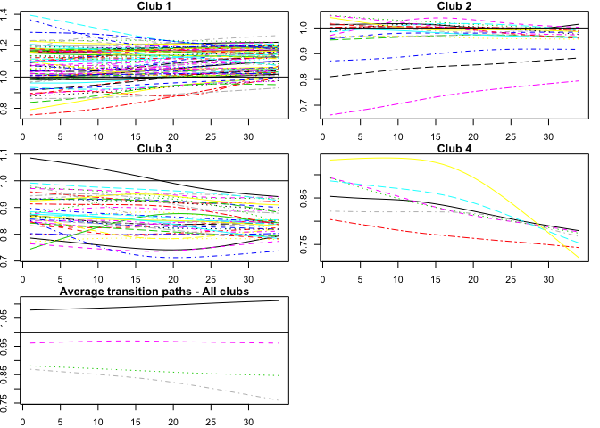
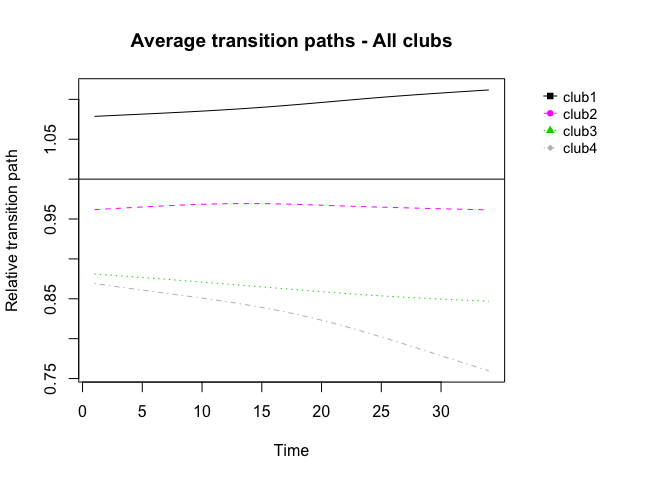

Convergence club analysis in R
================
Carlos Mendez

<style>
h1.title {font-size: 18pt; color: DarkBlue;} 
body, h1, h2, h3, h4 {font-family: "Palatino", serif;}
body {font-size: 12pt;}
/* Headers */
h1,h2,h3,h4,h5,h6{font-size: 14pt; color: #00008B;}
body {color: #333333;}
a, a:hover {color: #8B3A62;}
pre {font-size: 12px;}
</style>

Suggested citation:

> Mendez C. (2020). Convergence club analysis in R. R Studio/RPubs.
> Available at <https://rpubs.com/quarcs-lab/tutorial-convergence-clubs>

This work is licensed under the Creative Commons Attribution-Non
Commercial-Share Alike 4.0 International License.

Acknowledgment:

Material adapted from multiple sources, in particular \[Sichera and
Pizzuto
(2019)\]<https://journal.r-project.org/archive/2019/RJ-2019-021/RJ-2019-021.pdf>)

# Libraries

## Install libraries

``` r
install.packages("devtools")
devtools::install_github("rhobis/ConvergenceClubs")
packageVersion("ConvergenceClubs") 
```

``` r
install.packages("tidyverse")
packageVersion("tidyverse") 
```

## Load libraries

``` r
knitr::opts_chunk$set(echo = TRUE)

library(ConvergenceClubs)
library(tidyverse)

# Change the presentation of decimal numbers to 4 and avoid scientific notation
options(prompt="R> ", digits=4, scipen=100)
```

# Tutorial objectives

  - Import `.csv` from github as `data.frame`

## Replication files

  - If you are a member of the [QuaRCS
    lab](https://quarcs-lab.rbind.io/), you can run this tutorial in [R
    Studio Cloud](https://rstudio.cloud/spaces/15597/project/965714) and
    access the files in the following [Github
    Repository](https://github.com/quarcs-lab/ConvergenceClubs)

## Preliminary material

  - [Sichera, R. and Pizzuto, P., 2019. ConvergenceClubs: A Package for
    Performing the Phillips and Sul’s Club Convergence Clustering
    Procedure. The R
    Journal](https://journal.r-project.org/archive/2019/RJ-2019-021/RJ-2019-021.pdf).

# Import data

``` r
y <- read_csv("https://raw.githubusercontent.com/quarcs-lab/ConvergenceClubs/master/data/filteredGDP.csv")
```

    ## Parsed with column specification:
    ## cols(
    ##   .default = col_double(),
    ##   Countries = col_character()
    ## )

    ## See spec(...) for full column specifications.

``` r
y <- as.data.frame(y)
head(y)
```

    ##     Countries Y1970 Y1971 Y1972 Y1973 Y1974 Y1975 Y1976 Y1977 Y1978 Y1979 Y1980
    ## 1 Afghanistan 7.564 7.591 7.617 7.643 7.667 7.690 7.710 7.727 7.742 7.754 7.762
    ## 2     Algeria 8.303 8.321 8.339 8.358 8.376 8.395 8.415 8.436 8.457 8.478 8.499
    ## 3     Antigua 8.439 8.452 8.466 8.480 8.495 8.513 8.534 8.559 8.588 8.622 8.661
    ## 4   Argentina 9.227 9.227 9.227 9.226 9.226 9.224 9.221 9.218 9.214 9.209 9.203
    ## 5   Australia 9.602 9.618 9.633 9.649 9.665 9.681 9.696 9.712 9.728 9.745 9.761
    ## 6     Austria 9.491 9.521 9.551 9.580 9.609 9.638 9.665 9.692 9.718 9.744 9.768
    ##   Y1981 Y1982 Y1983 Y1984 Y1985 Y1986 Y1987 Y1988 Y1989 Y1990  Y1991  Y1992
    ## 1 7.765 7.762 7.752 7.735 7.709 7.673 7.628 7.574 7.511 7.440  7.362  7.278
    ## 2 8.518 8.537 8.554 8.569 8.582 8.594 8.603 8.610 8.615 8.619  8.621  8.623
    ## 3 8.704 8.751 8.802 8.855 8.910 8.966 9.022 9.078 9.132 9.185  9.234  9.282
    ## 4 9.197 9.190 9.184 9.178 9.174 9.172 9.172 9.174 9.178 9.185  9.194  9.206
    ## 5 9.777 9.794 9.811 9.828 9.845 9.862 9.880 9.898 9.916 9.934  9.953  9.973
    ## 6 9.792 9.815 9.837 9.859 9.881 9.902 9.924 9.945 9.966 9.986 10.006 10.026
    ##    Y1993  Y1994  Y1995  Y1996  Y1997  Y1998  Y1999  Y2000  Y2001  Y2002  Y2003
    ## 1  7.189  7.097  7.002  6.905  6.806  6.705  6.602  6.498  6.395  6.292  6.190
    ## 2  8.624  8.626  8.628  8.630  8.633  8.636  8.640  8.645  8.650  8.654  8.659
    ## 3  9.326  9.369  9.408  9.446  9.483  9.518  9.552  9.586  9.619  9.652  9.685
    ## 4  9.218  9.231  9.243  9.255  9.265  9.273  9.280  9.285  9.289  9.292  9.295
    ## 5  9.994 10.016 10.038 10.061 10.084 10.108 10.132 10.156 10.180 10.205 10.229
    ## 6 10.046 10.065 10.085 10.104 10.123 10.143 10.162 10.181 10.201 10.220 10.239

This dataframe should be filtered in order to remove business cycles.
Also, it must not contain any NA or NaN values.

# Define parameters

## For finding clubs

  - `dataCols`: integer vector with the column indices of the data

<!-- end list -->

``` r
PAR_dataCols <- 2:35
```

  - `unit_names`: integer scalar indicating, if present, the index of a
    column with codes of the units

<!-- end list -->

``` r
PAR_unit_names <- 1
```

  - `refCol`: integer scalar indicating the index of the column to use
    for ordering data

<!-- end list -->

``` r
PAR_refCol <- 35
```

  - `time_trim`: a numeric value between 0 and 1, representing the
    portion of time periods to trim when running log-t regression model.
    Phillips and Sul (2007, 2009) suggest to discard the first third of
    the period.

<!-- end list -->

``` r
PAR_time_trim <- 1/3
```

  - `HACmethod`: string indicating whether a Fixed Quadratic Spectral
    Bandwidth (HACmethod=“FQSB”) or an Adaptive Quadratic Spectral
    Bandwidth (HACmethod=“AQSB”) should be used for the truncation of
    the Quadratic Spectral kernel in estimating the log-t regression
    model with heteroskedasticity and autocorrelation consistent
    standard errors. The default method is “FQSB”.

<!-- end list -->

``` r
PAR_HACmethod <- "AQSB"
```

  - `cstar`: numeric scalar, indicating the threshold value of the sieve
    criterion (c\*) to include units in the detected core (primary)
    group (step 3 of Phillips and Sul (2007, 2009) clustering
    algorithm). The default value is 0.

<!-- end list -->

``` r
PAR_cstar <- 0
```

  - `cstar_method`: a string specifying whether cstar should be
    mantained fixed (cstar\_method=“fixed”) or increased iteratively
    until the whole club satisfies the condition tvalue\>-1.65
    (cstar\_method=“incremental”). Default is cstar\_method=“fixed” (see
    Details).

<!-- end list -->

``` r
PAR_cstar_method <- "fixed"
```

  - `cstar_increment`: a positive value specifying the increment to
    cstar, only valid if cstar\_method=“incremental” (see Details); the
    default value is 0.1.

<!-- end list -->

``` r
PAR_cstar_increment <- 0.1
```

  - `cstar_cap`: scalar indicating the maximum value up to which cstar
    can be increased; the default value is 3.

<!-- end list -->

``` r
PAR_cstar_cap <- 3
```

## For merging clubs

  - `mergeMethod`: character string indicating the merging method to
    use. Methods available are “PS” for Phillips and Sul (2009) and
    “vLT” for von Lyncker and Thoennessen (2017).

<!-- end list -->

``` r
PAR_mergeMethod <- "PS"
```

  - `threshold`: a numeric value indicating the threshold to be used
    with the t-test.

<!-- end list -->

``` r
PAR_threshold <- -1.65
```

  - `mergeDivergent`: logical, if TRUE, indicates that merging of
    divergent units should be tried.

<!-- end list -->

``` r
PAR_mergeDivergent <- FALSE
```

  - `estar`: a numeric value indicating the threshold e\* to test if
    divergent units may be included in one of the new convergence clubs.
    To be used only if mergeDivergent=TRUE

<!-- end list -->

``` r
#PAR_estar <- 
```

# Compute transitonal paths

h(it) = N log\[y(it)\] / ∑ log\[y(it)\]

``` r
h <- computeH(y[,-1], quantity="h")
```

# Compute cross-sectional variance

The cross sectional variation H(it) is computed as the quadratic
distance measure for the panel from the common limit and under the
hypothesis of the model should converge to zero as t tends towards
infinity:

H(t) = 1/N ∑ \[h(it)-1\]^2 –\> 0 as t -\> infinity

``` r
H <- computeH(y[,-1], quantity="H")
```

# Compute variance ratio

# Convergence test

Estimates the log-t regression model proposed by Phillips and Sul (2007,
2009) in order to investigate the presence of convergence by adopting
the Andrews estimator of long-run variance (fixed or adaptive bandwidth
of the kernel).

The following linear model is estimated:

log\[H(1)/H(t)\] - 2log\[log(t)\] = α + β log(t) + u(t)

Heteroskedasticity and autocorrelation consistent (HAC) standard errors
are used with Quadratic Spectral kernel (Andrews, 1991), If
HACmethod=“FQSB”, a fixed bandwidth parameter is applied, while with
HACmethod=“AQSB” an adaptive bandwidth parameter is employed.

``` r
log_t_test <- estimateMod(H, 
                          time_trim = PAR_time_trim, 
                          HACmethod = PAR_HACmethod)
log_t_test
```

    ##                                     beta 
    ##   -0.87481124037655777492261677252827212 
    ##                                  std.err 
    ##    0.00677576340006020780282192106369621 
    ##                                   tvalue 
    ## -129.10888245725706724442716222256422043 
    ##                                   pvalue 
    ##    0.00000000000000000000000000000006073

# Find clubs

Find convergence clubs by means of Phillips and Sul clustering
procedure.

Phillips and Sul clustering procedure, the following steps are
implemented:

(Cross section last observation ordering): Sort units in descending
order according to the last panel observation of the period;

(Core group formation): Run the log-t regression for the first k units
(2 \< k \< N) maximizing k under the condition that t-value is \> -1.65.
In other words, chose the core group size k\* as follows:

k\* = argmax , t(k)

subject to

min t(k) \> 1.65

If the condition t(k) \> -1.65 does not hold for k = 2 (the first two
units), drop the first unit and repeat the same procedure. If t(k) \>
-1.65 does not hold for any units chosen, the whole panel diverges;

(Sieve the data for club membership): After the core group is detected,
run the log-t regression for the core group adding (one by one) each
unit that does not belong to the latter. If t(k) is greater than a
critical value c\* add the new unit in the convergence club. All these
units (those included in the core group k\* plus those added) form the
first convergence club. Note that Phillips and Sul (2007) suggest to
make sure t(k) \> -1.65 for the subconvergence group obtained.
Otherwise, repeat the procedure by increasing the value of the c\*
parameter until the condition t(k) \> -1.65 is satisfied for the
subconvergence group;

(Recursion and stopping rule): If there are units for which the previous
condition fails (t(k) \< c\*), gather all these units in one group and
run the log-t test to see if the condition t(k) \> -1.65 holds. If the
condition is satisfied, conclude that there are two convergence clubs.
Otherwise, step 1 to 3 should be repeated on the same group to determine
whether there are other subgroups that constitute convergence clubs. If
no k in step 2 satisfies the condition t(k) \> -1.65, the remaining
units diverge.

Note that the clustering procedure may return groups with t(k) \< -1.65,
which are not really convergence clubs. In this case, following step 3
of the clustering procedure there are two options: (i) allow an
iterative increase of the cstar parameter until the subconvergence club
satisfies the condition t(k) \> -1.65. In this case it should the
argument cstar\_method should be set to “incremental” and a positive
argument for the cstar\_increment argument should be chosen; (ii)
increase the value of the cstar in order to increase the discriminatory
power of the log-t test in the formation of each club.

``` r
clubs <- findClubs(y, 
                   dataCols        = PAR_dataCols, 
                   unit_names      = PAR_unit_names, 
                   refCol          = PAR_refCol, 
                   time_trim       = PAR_time_trim, 
                   HACmethod       = PAR_HACmethod,
                   cstar           = PAR_cstar,
                   cstar_method    = PAR_cstar_method,
                   cstar_increment = PAR_cstar_increment,
                   cstar_cap       = PAR_cstar_cap)
summary(clubs)
```

    ## Number of convergence clubs: 5
    ## Number of divergent units: 3
    ## 
    ##         | # of units  | beta     | std.err  | tvalue    | cstar  
    ## -------- ------------- ---------- ---------- ----------- --------
    ##  club1  |   84        |  -0.116  |   0.023  |  -4.979   |   0    
    ##  club2  |   18        |   0.159  |   0.045  |   3.508   |   0    
    ##  club3  |   26        |   0.163  |   0.054  |   3.014   |   0    
    ##  club4  |   14        |   0.164  |   0.037  |   4.419   |   0    
    ##  club5  |   7         |   1.79   |   0.166  |   10.801  |   0

# Merge clubs

Merges a list of clubs created with the function findClubs by either
Phillips and Sul method or von Lyncker and Thoennessen procedure.

Phillips and Sul (2009) suggest a “club merging algorithm” to avoid over
determination due to the selection of the parameter c\*. This algorithm
suggests to merge for adjacent groups. In particular, it works as
follows:

Take the first two groups detected in the basic clustering mechanism and
run the log-t test. If the t-statistic is larger than -1.65, these
groups together form a new convergence club;

Repeat the test adding the next group and continue until the basic
condition (t-statistic \> -1.65) holds;

If convergence hypothesis is rejected, conclude that all previous groups
converge, except the last one. Hence, start again the test merging
algorithm beginning from the group for which the hypothesis of
convergence did not hold.

On the other hand, von Lyncker and Thoennessen (2017), propose a
modified version of the club merging algorithm that works as follows:

Take all the groups detected in the basic clustering mechanism (P) and
run the t-test for adjacent groups, obtaining a (M × 1) vector of
convergence test statistics t (where M = P - 1 and m = 1, …, M);

Merge for adjacent groups starting from the first, under the conditions
t(m) \> -1.65 and t(m) \> t(m+1). In particular, if both conditions
hold, the two clubs determining t(m) are merged and the algorithm starts
again from step 1, otherwise it continues for all following pairs;

For the last element of vector M (the value of the last two clubs) the
only condition required for merging is t(m=M) \> -1.65.

``` r
mclubs <- mergeClubs(clubs,
                     mergeMethod     = PAR_mergeMethod,
                     threshold       = PAR_threshold,
                     mergeDivergent  = PAR_mergeDivergent)
summary(mclubs)
```

    ## Number of convergence clubs: 4
    ## Number of divergent units: 3
    ## 
    ##         | merged clubs  | # of units  | beta     | std.err  | tvalue    
    ## -------- --------------- ------------- ---------- ---------- -----------
    ##  club1  | clubs: 1      |   84        |  -0.116  |   0.023  |  -4.979   
    ##  club2  | clubs: 2      |   18        |   0.159  |   0.045  |   3.508   
    ##  club3  | clubs: 3, 4   |   40        |  -0.118  |   0.079  |  -1.49    
    ##  club4  | clubs: 5      |   7         |   1.79   |   0.166  |   10.801

# List clubs

``` r
print(mclubs)
```

    ## ======================================================================== 
    ## club 1
    ## ------------------------------------------------------------------------ 
    ## United.States, Norway, Bermuda, United.Arab.Emirates, Qatar, Singapore, 
    ## Switzerland, Hong.Kong, Denmark, Ireland, Austria, Australia, Canada, 
    ## Macao, Netherlands, Kuwait, Iceland, United.Kingdom, Germany, France, 
    ## Sweden, Belgium, Japan, Brunei, Finland, Italy, Cyprus, Luxembourg, 
    ## Puerto.Rico, Israel, New.Zealand, Taiwan, Spain, Malta, Bahrain, 
    ## Korea..Republic.of, Portugal, Bahamas, Oman, Mauritius, Antigua, 
    ## St..Kitts...Nevis, Barbados, Saudi.Arabia, Trinidad..Tobago, Greece, 
    ## Netherlands.Antilles, Chile, Malaysia, Hungary, Argentina, Uruguay, 
    ## Gabon, Equatorial.Guinea, Swaziland, Poland, Costa.Rica, South.Africa, 
    ## Dominica, Panama, St.Vincent...Grenadines, Botswana, Mexico, Tunisia, 
    ## Thailand, Brazil, Dominican.Republic, St..Lucia, Venezuela, Belize, 
    ## Iran, Colombia, Grenada, Algeria, Turkey, Cuba, Cape.Verde, China, 
    ## Maldives, Egypt, Sri.Lanka, Indonesia, Tonga, India
    ## 
    ## beta:     -0.1155 
    ## std.err:   0.0232 
    ## tvalue:   -4.979 
    ## pvalue:    0.0001 
    ## 
    ## ======================================================================== 
    ## club 2
    ## ------------------------------------------------------------------------ 
    ## Suriname, Romania, Namibia, El.Salvador, Paraguay, Fiji, Jamaica, 
    ## Papua.New.Guinea, Ecuador, Peru, Morocco, Micronesia..Fed..Sts., 
    ## Guatemala, Jordan, Philippines, Pakistan, Lesotho, Bhutan
    ## 
    ## beta:      0.1591 
    ## std.err:   0.0454 
    ## tvalue:    3.5075 
    ## pvalue:    0.0021 
    ## 
    ## ======================================================================== 
    ## club 3
    ## ------------------------------------------------------------------------ 
    ## Nicaragua, Samoa, Bolivia, Vanuatu, Zimbabwe, Guinea, Cameroon, 
    ## Honduras, Cote.d.Ivoire, Syria, Solomon.Islands, Iraq, Mauritania, 
    ## Nepal, Mongolia, Senegal, Ghana, Laos, Korea..Dem..Rep., Benin, 
    ## Mozambique, Mali, Uganda, Burkina.Faso, Tanzania, Ethiopia, 
    ## Congo..Republic.of, Kiribati, Sao.Tome.and.Principe, Comoros, Kenya, 
    ## Sudan, Nigeria, Rwanda, Gambia..The, Central.African.Republic, Zambia, 
    ## Chad, Malawi, Cambodia
    ## 
    ## beta:     -0.1183 
    ## std.err:   0.0794 
    ## tvalue:   -1.4901 
    ## pvalue:    0.1511 
    ## 
    ## ======================================================================== 
    ## club 4
    ## ------------------------------------------------------------------------ 
    ## Niger, Togo, Madagascar, Burundi, Sierra.Leone, Guinea.Bissau, 
    ## Afghanistan
    ## 
    ## beta:      1.7901 
    ## std.err:   0.1657 
    ## tvalue:    10.8012 
    ## pvalue:    0 
    ## 
    ## ======================================================================== 
    ## divergent
    ## ------------------------------------------------------------------------ 
    ## Somalia, Congo..Dem..Rep., Liberia

# Plot clubs

``` r
par(mar=c(2.1,1.8,1,1))
plot(mclubs)
```

<!-- -->

``` r
plot(mclubs, clubs=NULL, legend=TRUE)
```

<!-- -->

# References

  - Andrews, D. W., 1991. Heteroskedasticity and autocorrelation
    consistent covariance matrix estimation. Econometrica: Journal of
    the Econometric Society, 817-858.

  - Phillips, P. C.; Sul, D., 2007. Transition modeling and econometric
    convergence tests. Econometrica 75 (6), 1771-1855.

  - Phillips, P. C.; Sul, D., 2009. Economic transition and growth.
    Journal of Applied Econometrics 24 (7), 1153-1185.

  - Von Lyncker, K.; Thoennessen, R., 2017. Regional club convergence in
    the EU: evidence from a panel data analysis. Empirical Economics 52
    (2), 525-553

  - [Sichera, R. and Pizzuto, P., 2019. ConvergenceClubs: A Package for
    Performing the Phillips and Sul’s Club Convergence Clustering
    Procedure. The R
    Journal](https://journal.r-project.org/archive/2019/RJ-2019-021/RJ-2019-021.pdf).

  - <https://rhobis.rbind.io/convergenceclubs/index.html>

  - <https://rhobis.rbind.io/convergenceclubs/reference/index.html>

  - <https://cran.r-project.org/web/packages/ConvergenceClubs>

  - <https://github.com/rhobis/ConvergenceClubs>

  - <https://rhobis.rbind.io/blog/convergenceclubs-package-release>

  - <https://rpubs.com/econdata777/ConvergenceClub-package>

END
